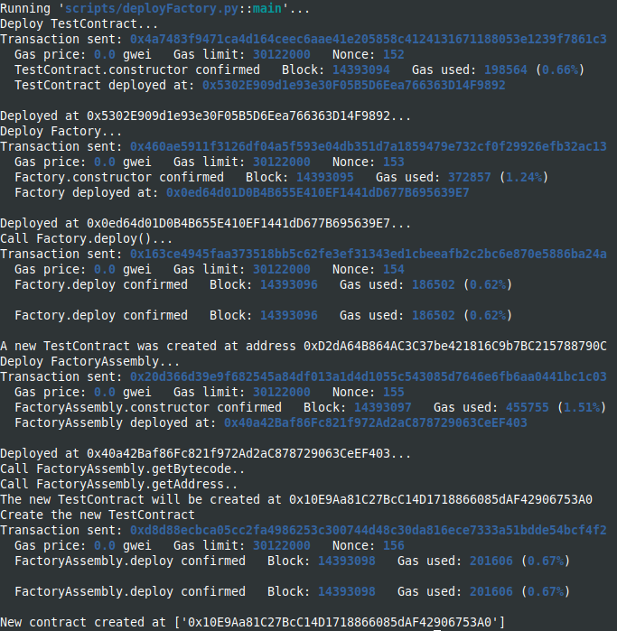

Study cases of precomputing contract addresses, from Solidity documentation and Solidity by example site [Solidity by Example,Precompute Contract Address with Create2 ](https://solidity-by-example.org/app/create2/)

I used brownie with hardhat in order to deploy and use the console.log features.
You should start the hardhat node in another terminal and folder (`hh node`), then, in a terminal :

```
brownie compile
brownie run scripts/deploySimple.py
brownie run scripts/deployFactory.py
```

The code is filled with console.log calls in order to see the different calls and the execution of functions.

Deployment from brownie, screenshot of console at the end:


From the hardhat console, the console.log output:


Deployment from brownie, screenshot of console at the end:

